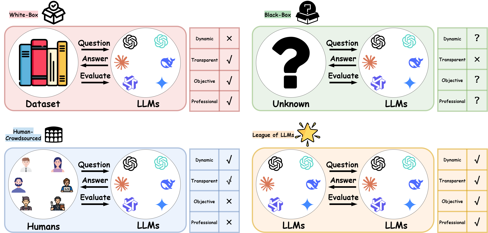
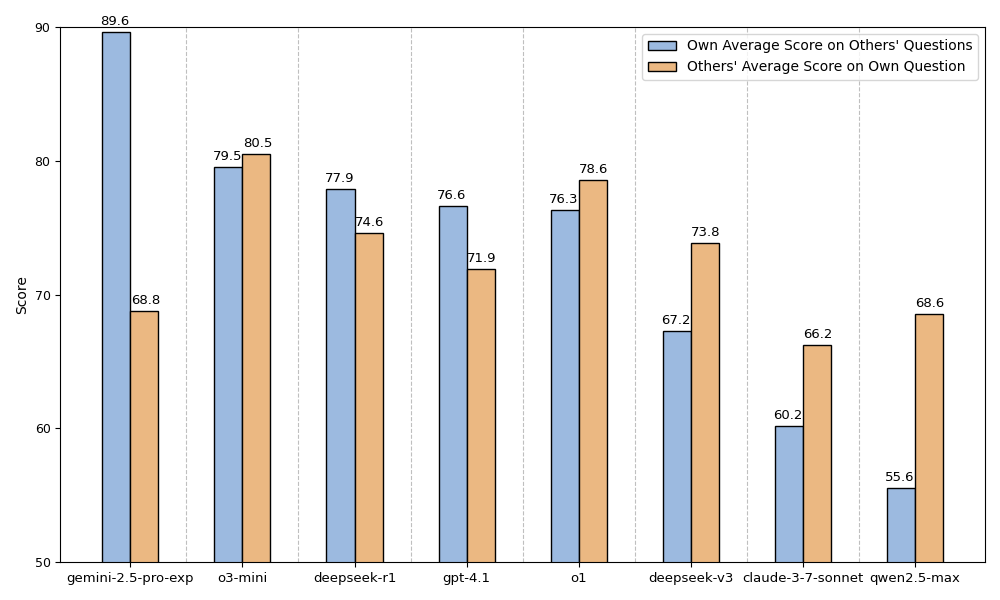

# ⭐ League of LLMs 

**Paper Title**: League of LLMs: A Benchmark-Free Paradigm for Mutual Evaluation of Large Language Models
**Arxiv**: https://arxiv.org/abs/2507.22359

------

## ✨ Project Overview 

We introduce League of LLMs (LOL), a novel benchmark-free evaluation paradigm built on a closed-loop of mutual questioning, answering, and evaluation among LLMs. 

LOL organizes multiple LLMs into a self-governed league, where they compete for leaderboard positions across multiple rounds. 

In each round, LLMs take turns (i) generating questions, (ii) answering independently, and (iii) mutually evaluating one another, with the final ranking computed by aggregating the resulting scores.

## 🤖 Motivation



## ⚔️ Methodology 


------

## 📁 Repository Structure 

```
League of LLMs/
│
├── exp/
│   ├── models.py
│   ├── config.py
│   ├── math_experiment.py
│   └── programming_experiment.py
├── assets/
│   ├── methodology.png
│   ├── motivations.png
│   ├── Radar.png
│   ├── score.png
│   ├── math_spearman_heatmap.png
│   └── programming_spearman_heatmap.png
├── requirements.txt
└── Readme.md
```

------

## ⚙️ Configuration 

Edit `exp/config.py`:

- `API_KEY`: your API key 🔑
- `API_BASE`: OpenAI-compatible base URL (the code calls `POST {API_BASE}/chat/completions`) 🌐
- `MODELS`: model list to evaluate 🤖
- (optional) `RESULTS_DIR`, `DEFAULT_TEMPERATURE`, `STREAMING` 🛠️

------

## 🚀 Quick Start 

We recommend Python 3.9+.

Install deps:

```bash
pip install -r requirements.txt
```

Run mathematics experiment:

```bash
python exp/math_experiment.py
```

Run programming experiment:

```bash
python exp/programming_experiment.py
```

Outputs will be saved under `RESULTS_DIR` (default: `results/`) with a timestamped experiment folder.

------

## 📈 Experimental Results 

**Math results**


**Programming results**



**Spearman correlation heatmaps**


------

## 🔗 Citation

If you find our work helpful, please cite us.

```
@article{guo2025llm,
  title={LLM-Crowdsourced: A Benchmark-Free Paradigm for Mutual Evaluation of Large Language Models},
  author={Guo, Qianhong and Xie, Wei and Cai, Xiaofang and Wang, Enze and Ma, Shuoyoucheng and Chen, Kai and Wang, Xiaofeng and Wang, Baosheng},
  journal={arXiv preprint arXiv:2507.22359},
  year={2025}
}
```

## 🤝 Contact 

- Suggestions, feedback, and collaboration are very welcome!

- Contact: [guoqianh1@163.com](mailto:guoqianh1@163.com)
