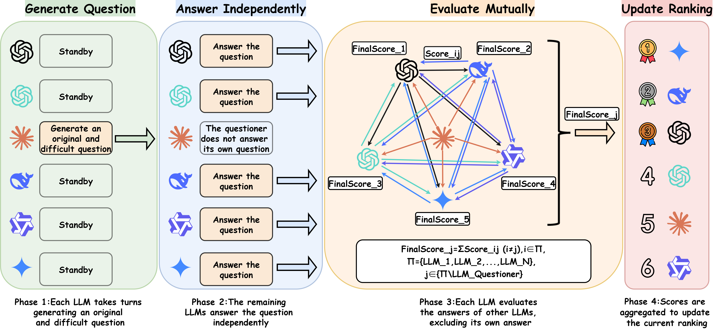
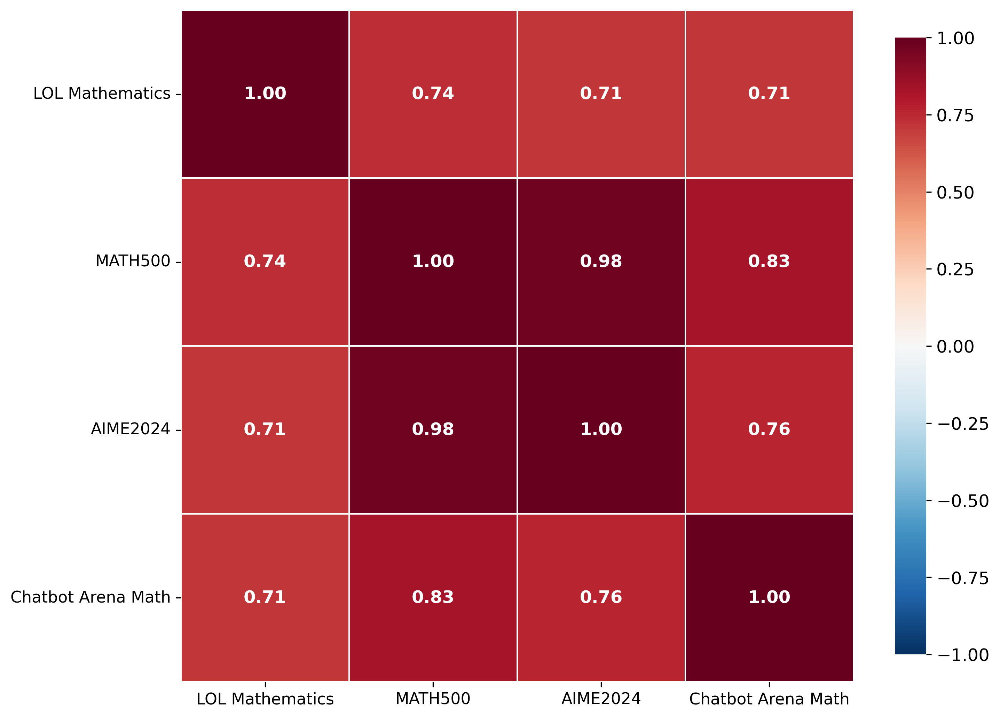
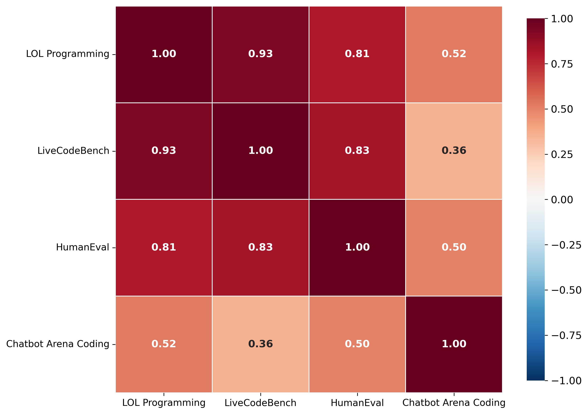

# ⭐ League of LLMs

**Paper Title**: League of LLMs: A Benchmark-Free Paradigm for Mutual Evaluation of Large Language Models

**Paper Link**: https://arxiv.org/abs/2507.22359

**Paper Website:** https://qhovo1.github.io/League-of-LLMs

## ✨ Project Overview

League of LLMs (LOL) is a novel benchmark-free evaluation paradigm built on a closed-loop of mutual questioning, answering, and evaluation among LLMs. 

LOL organizes multiple LLMs into a self-governed league, where they compete for leaderboard positions across multiple rounds.

In each round, LLMs take turns (i) generating questions, (ii) answering independently, and (iii) mutually evaluating one another, with the final ranking computed by aggregating the resulting scores.

## 🤖 Motivation


Figure 1: **Mainstream LLM evaluation paradigms vs. League of LLMs (LOL).** Compared under four core criteria: Dynamic, Transparent, Objective, and Professional.

## ⚔️ Methodology



Figure 2: **Overview of the League of LLMs evaluation pipeline.** It consists of four phases: Generate Question, Answer Independently, Evaluate Mutually, and Update Ranking.

## 📁 Structure

```
League of LLMs/
│
├── core/
│   ├── models.py
│   ├── config.py
│   ├── math_experiment.py
│   └── programming_experiment.py
├── figures/
│   ├── methodology.png
│   ├── motivations.png
│   ├── Radar.png
│   ├── score.png
│   ├── math_spearman_heatmap.png
│   └── programming_spearman_heatmap.png
├── requirements.txt
└── Readme.md
```

## ⚙️ Configuration

Edit `core/config.py`:

- `API_KEY`: your API key 🔑
- `API_BASE`: OpenAI-compatible base URL (the code calls `POST {API_BASE}/chat/completions`) 🌐
- `MODELS`: model list to evaluate 🤖
- (optional) `RESULTS_DIR`, `DEFAULT_TEMPERATURE`, `STREAMING` 🛠️

## 🚀 Quick Start

We recommend Python 3.9+.

Install deps:

```bash
pip install -r requirements.txt
```

Run mathematics experiment:

```bash
python core/math_experiment.py
```

Run programming experiment:

```bash
python core/programming_experiment.py
```

Outputs will be saved under `RESULTS_DIR` (default: `results/`) with a timestamped experiment folder.

## 📈 Results

**Math results**


**Programming results**


**Spearman correlation heatmaps**



## 🔗 Citation

If you find our work helpful, please cite us.

```
@misc{guo2026leaguellmsbenchmarkfreeparadigm,
      title={League of LLMs: A Benchmark-Free Paradigm for Mutual Evaluation of Large Language Models}, 
      author={Qianhong Guo and Wei Xie and Xiaofang Cai and Enze Wang and Shuoyoucheng Ma and Xiaobing Sun and Tian Xia and Kai Chen and Xiaofeng Wang and Baosheng Wang},
      year={2026},
      eprint={2507.22359},
      archivePrefix={arXiv},
      primaryClass={cs.AI},
      url={https://arxiv.org/abs/2507.22359}, 
}
```

## 🤝 Contact

- Suggestions, feedback, and collaboration are very welcome!

- Contact: [guoqianh1@163.com](mailto:guoqianh1@163.com)
