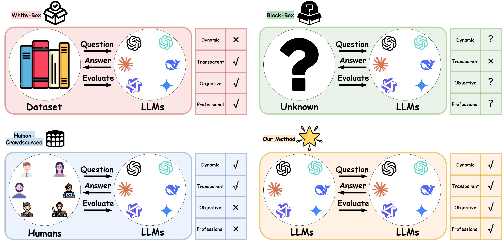
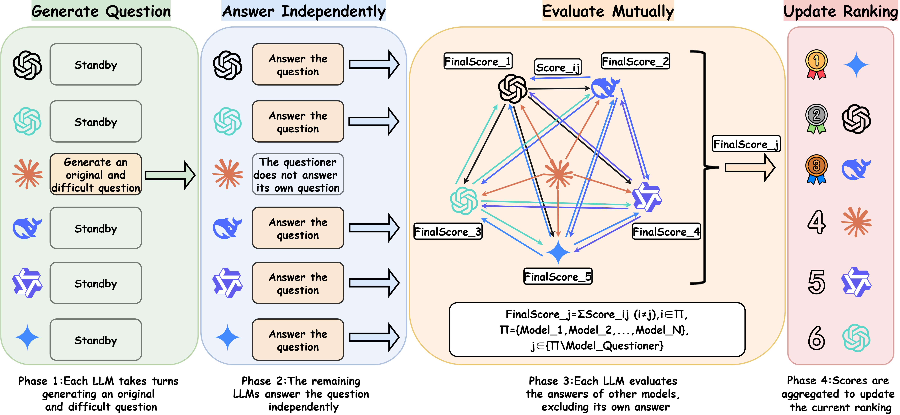
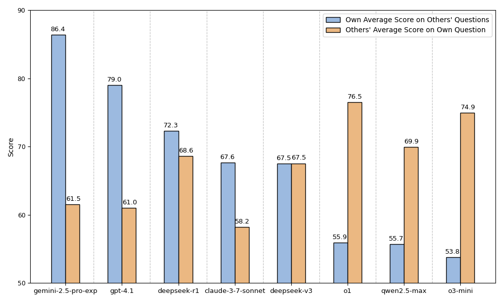

# LLM-Crowdsourced

**论文全称**：LLM-Crowdsourced: A Benchmark-Free Paradigm for Mutual Evaluation of Large Language Models 
**论文链接**：https://arxiv.org/abs/2507.22359

## 项目简介

LLM-Crowdsourced 是一个面向大语言模型（LLM）互评的开源实验平台，提出了一种“无基准集”的新范式，通过让多种主流大模型互相出题、互相答题、互相评分，自动生成高质量的评测数据和排名，无需人工标注和传统基准集。
本项目支持数学与编程两大类实验，自动化生成实验报告和可视化结果，适用LLM能力评测、对比分析和学术研究。




## 目录结构

```
LLM-Crowdsourced/
│
├── exp/                        # 实验主程序与配置
│   ├── config.py               # 配置文件，设置API、LLM、参数等
│   ├── models.py               # LLM的API封装与调用逻辑
│   ├── math_experiment.py      # 数学实验主程序
│   └── programming_experiment.py # 编程实验主程序
│
├── data_processing/            # 数据分析与可视化脚本
│   ├── score.py                # 统计/可视化LLM得分
│   ├── Radar.py                # 生成能力雷达图
│   └── TOP-k.py                # 计算top-k
│
├── assets/                     # 论文配图与实验可视化图片
│   ├── methodology.png         # 方法流程图
│   ├── motivations.png         # 研究动机与背景图
│   ├── Radar.png               # 各LLM能力雷达图
│   └── score.png               # 评分分布/排名可视化
│
├── results/                    # 实验结果（自动生成，含json和excel报告）
│   └── ...                     # 每次实验的详细过程、评分、排名等
│
├── requirements.txt            # 依赖包列表
└── Readme_cn.md                # 中文项目说明文档
└── Readme.md                   # 英文项目说明文档
└── Appendix.pdf                # 具体例子展示附录
```

---

## 快速开始

1. **环境准备**
   - Python 3.8+
   - 推荐通过以下命令安装依赖：`pip install -r requirements.txt`

2. **配置参数**
   - 打开 `exp/config.py`，填写API_KEY、API_BASE。
   - 在 `MODELS` 列表中配置要参与互评的LLM（支持多种主流API，可灵活增删）。
   - 可设置是否流式输出、温度等参数。

3. **运行实验**
   - 数学实验：`python exp/math_experiment.py`
   - 编程实验：`python exp/programming_experiment.py`
   - 结果会自动保存在 `results/` 文件夹下，包含每轮详细过程、评分、排名和Excel报告。

4. **分析与可视化**
   - 进入 `data_processing/` 目录，使用如下脚本进行后续分析：
     - `score.py`：统计各LLM答题/出题得分，生成分组柱状图（score.pdf）。
     - `Radar.py`：生成各LLM能力雷达图（Radar.pdf），展示多维能力对比。
     - `TOP-k.py`：计算评委之间top-k重叠率，衡量互评一致性。
   - 相关可视化图片会自动保存在当前目录下。




## 主要功能与模块说明

### 1. 配置与LLM管理

- `exp/config.py` 
  用于集中管理API密钥、LLM列表、实验参数（如温度、是否流式输出等）。
  支持灵活增删LLM，便于横向对比。

- `exp/models.py` 
  封装了LLM的API调用、重试机制、流式/非流式输出处理等，支持多种主流大模型。

### 2. math_experiment.py

- 每轮由一个LLM出题，其他LLM作答，再由所有LLM互评。
- 自动抽取题目、标准答案、核心原理，所有输出均为JSON结构，便于后续分析。
- 支持自动生成每轮与总排名、详细评分理由、Excel报告。
- 评分机制：每个LLM对其他LLM答案进行排名，分数按排名分配，支持多评委融合。

### 3. programming_experiment.py

- 机制与数学实验类似，但题目为原创编程竞赛题，要求完整代码实现。
- 自动抽取题目描述、标准解、评分标准，所有LLM互评代码质量。
- 支持多轮实验与自动化报告。
- 评分机制：每个LLM对其他LLM代码打分（百分制），并给出详细理由。

### 4. 数据分析与可视化（data_processing/）

- `score.py`：统计每个LLM的答题平均分、出题平均分，生成分组柱状图（score.pdf）。
- `Radar.py`：根据Excel结果生成各LLM能力雷达图（Radar.pdf），直观展示多维能力。
- `TOP-k.py`：计算LLM之间top-k重叠率，衡量互评一致性。

### 5. 结果与可视化

- `results/` 
  自动保存每轮实验的详细过程、所有LLM的答案、互评理由、分数、排名等，支持JSON和Excel格式。
- `assets/` 
  存放论文配图和实验可视化图片，包括方法流程图、动机图、能力雷达图、评分分布等。

## **结果文件可视化展示**




---

## 论文引用

如果本项目对您有帮助，欢迎引用我们的论文：

```
@article{guo2025llm,
  title={LLM-Crowdsourced: A Benchmark-Free Paradigm for Mutual Evaluation of Large Language Models},
  author={Guo, Qianhong and Xie, Wei and Cai, Xiaofang and Wang, Enze and Ma, Shuoyoucheng and Chen, Kai and Wang, Xiaofeng and Wang, Baosheng},
  journal={arXiv preprint arXiv:2507.22359},
  year={2025}
}
```

---

## 联系与贡献

- 欢迎您提出宝贵意见或合作意向
- Contact me: [guoqianh1@nudt.edu.cn](mailto:guoqianh1@nudt.edu.cn)
